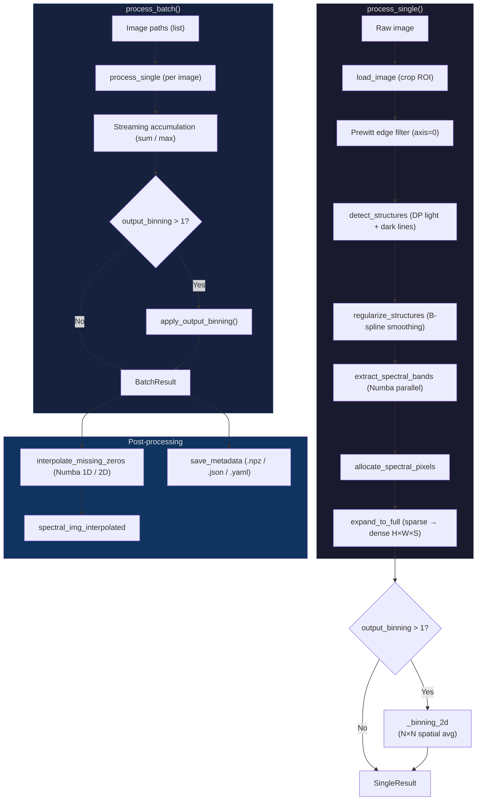

# Spectra-Spin

[](https://stand-with-ukraine.pp.ua)

Batch spectral image reconstruction from **spinning-disk spectral microscopy** data.

This project provides tools for extracting per-pixel spectral information from raw camera frames captured through a modified spinning-disk confocal.  A series of 2D monochrome images is analysed to detect periodic structures, isolate individual spectral bands, and assemble them into a single 3D hyperspectral data `(height, width, spectral_channels)`.

> Results presenting on Focus on Microscopy 2026 (Stockholm)
>
> __High-efficiency Hyperspectral Spinning Disk Confocal Microscopy via FPGA-Synchronized Prism Dispersion__

---

## Table of Contents

- [Overview](#overview)
- [Algorithm](#algorithm)
  - [Edge Filtering](#1-edge-filtering)
  - [Periodic Structure Detection](#2-periodic-structure-detection-dynamic-programming)
  - [Smoothing and Regularization](#3-smoothing-and-regularization)
  - [Spectral Band Extraction](#4-spectral-band-extraction)
  - [Spectral Pixel Allocation](#5-spectral-pixel-allocation)
  - [Batch Accumulation](#6-batch-accumulation)
- [Installation](#installation)
- [Quick Start](#quick-start)
- [API Reference](#api-reference)
  - [`SpectralRecon`](#class-spectralrecon)
  - [`SingleResult`](#dataclass-singleresult)
  - [`BatchResult`](#dataclass-batchresult)
- [Spinning Disk Simulation](#spinning-disk-simulation)
- [Spectral Analysis Demo](#spectral-analysis-demo)
- [Project Structure](#project-structure)
- [AI Disclaimer](#ai-disclaimer)

---

## Overview

A spinning-disk spectral microscopy system disperses the emission spectrum of each point in the sample across a series of spatially separated bands on the camera sensor.  Each raw frame therefore contains alternating **light** (signal) and **dark** (gap) horizontal stripes whose positions encode the spectral axis.

The reconstruction pipeline implemented here:

1. Detects the positions of these periodic stripes automatically using a
   dynamic-programming (DP) algorithm on the edge-filtered image.
2. Smooths and regularizes the detected positions with B-spline fitting.
3. Extracts the intensity data between adjacent dark boundaries to form
   per-band spectral slices.
4. Places those slices at their correct spatial coordinates to produce a 3-D
   hyperspectral image.
5. Optionally combines multiple frames using **sum** or **max** accumulation
   to improve the signal-to-noise ratio.

The primary module is `spin_recon.py` — a self-contained, Numba-accelerated implementation that provides maximal performance through JIT compilation and multi-threaded parallelism.

| Module | Description |
|--------|-------------|
| `spin_recon.py` | **Primary module.** Numba-accelerated reconstruction pipeline, interpolation, and spatial binning. |
| `batch_recon.py` | Legacy NumPy/SciPy implementation (kept for reference). |
| `batch_numba.py` | Legacy Numba add-on to `batch_recon.py` (kept for reference). |

### Pipeline diagram



---

## Algorithm

### 1. Edge Filtering

A **Prewitt filter** along the vertical axis (`axis=0`) is applied to the raw image to enhance horizontal intensity transitions - the boundaries between spectral bands:

```python
edge_image = prewitt(image, axis=0)
```

### 2. Periodic Structure Detection (Dynamic Programming)

The detected edge image is processed with a custom DP algorithm that traces globally optimal paths of maximum (for light lines) or minimum (for dark lines) cumulative intensity.

#### Light Line Detection

$$S_{\max}(i, j) = I(i, j) + \max_{k \in \{-1, 0, 1\}} S_{\max}(i+k,\; j-1)$$

The algorithm iteratively computes the maximum cumulative intensity matrix $S_{\max}$.  The value of each node $(i, j)$ is defined as the sum of the local pixel intensity $I(i, j)$ and the maximum accumulated value from three adjacent nodes in the preceding column $j - 1$.  This formulation guarantees the identification of the globally optimal path with the highest overall brightness.

#### Dark Line Detection

$$S_{\min}(i, j) = I(i, j) + \min_{k \in \{-1, 0, 1\}} S_{\min}(i+k,\; j-1)$$

The algorithm constructs the minimum cumulative cost matrix $S_{\min}$.  The value at point $(i, j)$ is calculated by adding the local intensity $I(i, j)$ to the minimum accumulated value from the local neighbourhood in the preceding column $j - 1$.  This minimises the total intensity along the graph, ensuring the localisation of the darkest optimal path.

In both equations, $i \in [0, M-1]$ represents the spatial row coordinate, $j \in [1, N-1]$ denotes the column coordinate, and $k$ constrains the spatial derivative of the path, restricting transitions exclusively to adjacent pixels.

#### Backtracking

$$P(i, j) = \arg\max_{k \in \{-1, 0, 1\}} S(i+k,\; j-1)$$

$$y(N-1) = \arg\max_{i \in [0, M-1]} S(i,\; N-1)$$

$$y(j-1) = y(j) + P(y(j),\; j), \quad \forall\, j \in \{N-1, \dots, 1\}$$

The backtracking phase reconstructs the spatial coordinates of the optimal continuous structure, denoted as $y(j)$, iterating from the last column $N - 1$ back to the first.  During the forward pass, a pointer matrix $P(i, j)$ is constructed to record the optimal spatial transition $k \in \{-1, 0, 1\}$ chosen to reach each node $(i, j)$.  The sequence is initialised by finding the global extremum (maximum for light structures, minimum for dark structures) in the final column of the cumulative cost matrix $S$.  The optimal path is then iteratively traced backward using the stored spatial offsets.

#### Spatial Period Estimation

$$P(y) = \mathrm{median}_{x \in [0, N-1]}\; I(y, x)$$

$$\bar{P}(y) = P(y) - \frac{1}{M}\sum_{k=0}^{M-1} P(k)$$

$$R(\tau) = \sum_{y=0}^{M-\tau-1} \bar{P}(y)\;\bar{P}(y+\tau)$$

$$T = \arg\max_{\tau > 0} R(\tau)$$

$$N \approx \lfloor M / T \rfloor$$

The automatic estimation of the spatial period is based on the 1D autocorrelation of the image's vertical intensity profile.  First, a robust spatial profile $P(y)$ is extracted by calculating the median intensity along the horizontal axis $x$ to suppress localised noise.  The DC component is subsequently removed to produce a zero-mean signal $\bar{P}(y)$.  The discrete autocorrelation function $R(\tau)$ is then computed for spatial lags $\tau$.  The spatial period $T$ (the distance between adjacent ridges or valleys) is identified by locating the first prominent global maximum of $R(\tau)$ at $\tau > 0$.  The expected number of continuous structures $N$ is approximated by dividing the total image height $M$ by the estimated period $T$.

### 3. Smoothing and Regularization

Detected light lines are approximated with **B-splines** (`scipy.interpolate.UnivariateSpline`) to suppress pixel-level jitter.  Dark boundaries are then re-generated at fixed, user-configurable distances (`dist_up` / `dist_down`) above and below each smoothed light line.  When these distances are not provided explicitly, they are estimated automatically from the median offset between detected light and dark lines.

### 4. Spectral Band Extraction

For each column of the image, the intensity values between the upper and lower dark boundaries of each band are extracted into a 3D array `(num_bands, image_width, spectral_width)`.

### 5. Spectral Pixel Allocation

Each extracted spectral band is placed at the row position of its corresponding light line in the output array, producing the final reconstructed spectral image of shape `(image_height, image_width, spectral_width)`.

### 6. Batch Accumulation

When multiple input images are processed, the resulting spectral images are combined pixel-wise using one of the following strategies:

| Method | Description |
|--------|-------------|
| `sum`  | Sum of all frames. |
| `max`  | Element-wise maximum across frames — prevents intensity doubling when different images share the same row index. |

> **Note:** The `max` method is recommended when row indices from different
> images overlap, as it avoids accumulation artefacts from duplicate summation.

---

## Installation

The project requires Python ≥ 3.9 and the following packages:

| Package | Purpose |
|---------|---------|
| `numpy` | Core array operations |
| `numba` | JIT compilation and multi-threaded parallelism |
| `scipy` | Edge filtering, signal processing, B-spline fitting |
| `scikit-image` | Image I/O |
| `matplotlib` | Visualisation (diagnostics) |
| `pyyaml` | Optional — YAML metadata serialization |

Install them via conda or pip:

```bash
conda install numpy numba scipy scikit-image matplotlib pyyaml
# or
pip install numpy numba scipy scikit-image matplotlib pyyaml
```

No additional installation step is needed — the module is standalone.

---

## Quick Start

```python
from spin_recon import SpectralRecon
import glob

recon = SpectralRecon(crop=(500, 2500, 1000, 2500),
                      spectral_band_width=100,
                      custom_lines_num=True,
                      lines_num=22,
                      output_binning=0)  # 0 or 1 = no binning

### Single image
result = recon.process_single("image_0001.tiff")
print(result.spectral_bands.shape)  # (num_bands, width, 100) — compact
print(result.spectral_img.shape)    # (H, W, 100) — full reconstructed
result.plot_reg_structure()         # overlay detected lines

# Expand compact → full manually (if needed)
full = recon.expand_to_full(
    result.image_shape, result.row_indices, result.spectral_bands,
)

### Batch processing
paths = sorted(glob.glob("data/QD_mix_40_phase/*.tiff"))
batch = recon.process_batch(paths, method="max")

batch.spectral_img                  # (H, W, S) accumulated image
batch.row_indices                   # {path: np.ndarray} metadata

# Interpolation (Numba-accelerated, fills zero-valued pixels)
batch.interpolate_missing_zeros(method="2d")
batch.spectral_img_interpolated     # (H, W, S) interpolated image

# Manual binning (in addition to automatic via output_binning)
batch.apply_output_binning(bin_size=4)

# Save / load metadata
batch.save_metadata("row_indices.npz")
batch.save_metadata("row_indices.json")
batch.save_metadata("row_indices.yaml")
```

---

## API Reference

### Class `SpectralRecon`

```python
class SpectralRecon(crop: tuple[int, int, int, int] | None = None,
                    spectral_band_width: int = 100,
                    custom_lines_num: bool = False,
                    lines_num: float = 20,
                    mask_width: float = 80,
                    lines_smooth_factor: float = 1e5,
                    dist_offset: float = 0,
                    custom_dist: bool = True,
                    dist_up: float | None = None,
                    dist_down: float | None = None,
                    precise_allocation: bool = False,
                    output_binning: int = 0)
```

#### Constructor Parameters

| Parameter | Type | Default | Description |
|-----------|------|---------|-------------|
| `crop` | `tuple` or `None` | `None` | ROI crop `(row_start, row_end, col_start, col_end)`. |
| `spectral_band_width` | `int` | `100` | Target number of spectral channels per band. |
| `custom_lines_num` | `bool` | `False` | Use fixed `lines_num` instead of auto-estimation. |
| `lines_num` | `float` | `20` | Number of periodic structures (when `custom_lines_num=True`). |
| `mask_width` | `float` | `80` | Half-width of the DP depletion mask. |
| `lines_smooth_factor` | `float` | `1e5` | B-spline smoothing parameter `s`. |
| `dist_offset` | `float` | `0` | Global offset added to `dist_up` / `dist_down`. |
| `custom_dist` | `bool` | `True` | Use `dist_up`/`dist_down` values directly. |
| `dist_up` | `float` or `None` | `None` | Fixed upward distance from light line to dark boundary. |
| `dist_down` | `float` or `None` | `None` | Fixed downward distance from light line to dark boundary. |
| `precise_allocation` | `bool` | `False` | Use per-column row indices (2-D) for curved-band fidelity. |
| `output_binning` | `int` | `0` | Spatial down-sampling factor. `0` or `1` = no binning. Averages each `N×N` block (ignoring zeros). |

#### Methods

| Method | Returns | Description |
|--------|---------|-------------|
| `load_image(path)` | `ndarray` | Load image and apply crop. |
| `detect_structures(edge_image)` | `dict` | DP-based light/dark line detection. |
| `regularize_structures(detected_lines)` | `dict` | Dark-line-based B-spline smoothing + boundary generation. |
| `regularize_structures_light(detected_lines)` | `dict` | Light-line-based B-spline smoothing + boundary generation. |
| `extract_spectral_bands(image, reg_lines, spectral_width)` | `ndarray` | Extract `(num_bands, W, S)` spectral cube. |
| `allocate_spectral_pixels(image, reg_lines, bands)` | `(row_indices, used_bands)` | Compact allocation — single row per band. |
| `allocate_spectral_pixels_precise(image, reg_lines, bands)` | `(row_indices, used_bands)` | Precise allocation — per-column row indices. |
| `expand_to_full(image_shape, row_indices, bands)` | `ndarray` | Expand compact → full `(H, W, S)`. |
| `process_single(image_path)` | `SingleResult` | Full pipeline for one image (with optional binning). |
| `process_batch(image_paths, method)` | `BatchResult` | Streaming batch processing (with optional binning). |

---

### Dataclass `SingleResult`

Returned by `SpectralRecon.process_single()`.

| Field | Type | Description |
|-------|------|-------------|
| `spectral_img` | `ndarray` | Full reconstructed spectral image `(H, W, S)`, float32. Binned if `output_binning > 1`. |
| `raw_image` | `ndarray` | Original input image (after cropping), 2-D. |
| `spectral_bands` | `ndarray` | Compact spectral data, shape `(num_bands, W, S)`. |
| `row_indices` | `ndarray` | Row positions for each band. 1-D `(num_bands,)` or 2-D `(num_bands, W)`. |
| `image_shape` | `tuple[int, int]` | `(height, width)` of the source image (after cropping). |
| `spectral_width` | `int` | Number of spectral channels. |
| `regularized_lines` | `dict` | Full regularized-line dictionary (diagnostics). |

#### Methods

| Method | Description |
|--------|-------------|
| `plot_reg_structure(figsize, cmap, linewidth)` | Overlay regularized lines on the raw image. |

---

### Dataclass `BatchResult`

Returned by `SpectralRecon.process_batch()`.

| Field | Type | Description |
|-------|------|-------------|
| `spectral_img` | `ndarray` | Accumulated spectral image `(H, W, S)`, float32. |
| `spectral_img_interpolated` | `ndarray` or `None` | Interpolated version; `None` until `interpolate_missing_zeros` is called. |
| `row_indices` | `dict[str, ndarray]` | Mapping `image_path → row-index array` for every image. |
| `num_images` | `int` | Number of processed images. |
| `spectral_width` | `int` | Spectral band width used. |
| `accumulation_method` | `str` | `'sum'` or `'max'`. |

#### Methods

| Method | Description |
|--------|-------------|
| `interpolate_missing_zeros(method)` | Fill zero-valued pixels via Numba-accelerated linear interpolation. `method`: `'1d'` (column-wise) or `'2d'` (two-pass row + column, default). |
| `apply_output_binning(bin_size)` | Down-sample `spectral_img` (and `spectral_img_interpolated` if present) by averaging non-zero pixels in each `bin_size × bin_size` block. |
| `save_metadata(path)` | Save row-index metadata to `.npz`, `.json`, or `.yaml`/`.yml`. |
| `BatchResult.load_metadata(path)` | **Static.** Load metadata back from file. |

---

## Spinning Disk Simulation

The `disk_simulation.ipynb` notebook provides a comprehensive physical and optical simulation of the Yokogawa CSU-10 spinning disk spectral module. It models the data acquisition process to generate synthetic test data that matches the features of real recordings. 

Key aspects of the simulation include:
- **Nipkow Disk Models:** Detailed geometric modelling of the Yokogawa CSU-10 spinning disk architecture, including pinhole arrangement and spacing.
- **Acquisition Simulation:** Emulation of camera integration across various disk rotational phases, simulating both continuous and discrete exposure schemes.
- **Spectral Imaging Phases Modeling:** Simulating the distribution and displacement of spectral bands (both demo phase imaging and whole phase set scenarios).
- **SIM Pattern Modeling:** Modeling structured illumination patterns inherent to spinning-disk architectures and assessing their influence on the reconstructed spectral spatial frequencies.

This model allows for extensive theoretical validation of the `spin_recon.py` algorithms without requiring physical microscope access.

---

## Spectral Analysis Demo

The notebook `demo_spec_analysis.ipynb` demonstrates the downstream analysis of reconstructed spectral images using the data provided in the `demo_data/` directory.

### Demo Data (`demo_data/`)
This directory contains sample inputs required to run the analysis:
- **`spec_img_recon.tiff`**: Full 3D reconstructed hyperspectral image `(S, H, W)` with interpolation.
- **`spec_img_mip_raw.tiff` / `spec_img_mip_inter.tiff`**: Maximum Intensity Projections (MIP) of raw and interpolated spectral images.
- **`spec_img_roi.tiff`**: Labeled image mask defining specific Regions of Interest (ROIs).
- **`spec_data_raw.csv` / `spec_data_inter.csv`**: Pre-extracted spectral profiles for the labeled ROIs.
- **`synthetic_test.tiff`**: Synthetic data for testing detection.

### Analysis Pipeline
The notebook walks through several stages of spectral data analysis:

#### 1. ROI Spectral Fitting
Spectra from individual ROIs are analyzed by fitting a sum of multiple Gaussian functions. The algorithm detects initial peak candidates using second-derivative minima and then refines the fit (`scipy.optimize.curve_fit`) to extract amplitude, position (mean), and width (sigma) for each peak.

#### 2. Lambda Mapping (Calibration)
The index positions of the fitted Gaussian peaks are correlated with expected physical emission wavelengths (e.g., 525 nm, 585 nm, 659 nm) to compute a linear spectral calibration (mapping pixels/indices to nanometers).

#### 3. Spectral Isotropy Estimation (Numba Accelerated)
To evaluate the uniformity of the spectral signal across the entire image on a per-pixel basis, a high-performance Numba-accelerated pipeline is used. Since the number of peaks per pixel varies (typically 1 to 3 due to the nature of the sample), relying solely on peak position ratios is unstable. Instead, the notebook computes robust metrics:

- **Robust Peak Detection**: The raw pixel spectrum is smoothed using a Triangle (Bartlett) kernel. Peaks are detected based on topological **prominence** (to ignore noise) and their positions are refined with sub-pixel accuracy using an intensity-weighted centroid in a local window.
- **Metric 1: Spectral Centroid**: The overall intensity-weighted "center of mass" of the pixel's spectrum. This metric is robust and computes a valid value even if distinct peaks cannot be resolved.
- **Metric 2: Peak Spacing CV (Coefficient of Variation)**: For pixels with 2 or more peaks, this metric calculates the standard deviation of the distances between adjacent peaks divided by their mean. A value close to 0 indicates perfectly uniform spacing.
- **Metric 3: EMD (Earth Mover's Distance)**: The pixel's normalized spectrum is compared against a reference distribution (the median spectrum of the entire image). EMD robustly quantifies how much "work" is required to transform the pixel's spectrum into the reference shape, serving as a stable anomaly/isotropy score.

The notebook concludes by visualizing these metrics as 2D spatial maps and distribution histograms.

---

## Project Structure

```text
spectra-spin/
├── spin_recon.py            # Primary module - SpectralRecon (Numba-accelerated)
├── batch_recon.py           # Legacy - NumPy/SciPy implementation
├── batch_numba.py           # Legacy - Numba add-on to batch_recon
├── demo_recon.ipynb         # Reconstruction demo & benchmarks
├── demo_spec_analysis.ipynb # Spectral analysis and isotropy estimation demo
├── demo_dev.ipynb           # Development notebook
├── disk_simulation.ipynb    # Physical simulation of Yokogawa CSU-10
├── demo_data/               # Data for the spectral analysis demo
├── data/                    # Sample datasets (TIFF images)
├── diff/                    # Legacy files and versions
└── README.md                # This file
```

---

## AI Disclaimer

The initial algorithm prototype was developed interactively in the Jupyter notebook `demo_dev.ipynb`.  The refactoring of this exploratory code into the structured, class-based production modules - including `batch_recon.py`, `batch_numba.py`, and the unified `spin_recon.py` - was performed with the assistance of **AI-based coding tools**.  This includes API design, documentation, type annotations, Numba JIT optimization, interpolation algorithms, spatial binning, batch accumulation logic, and metadata serialization.  All algorithmic logic faithfully reproduces the original notebook implementation; no modifications to the core numerical procedures were introduced during the refactoring process.